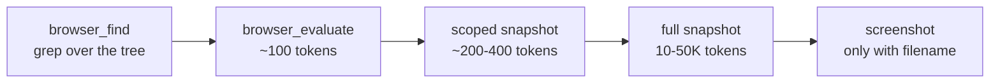

[Русский](README.md) · English

# browser — your logged-in Chrome through Playwright MCP

Claude works inside your live Chrome: logins, cookies, sessions and 2FA are already there. No separate profiles, no `--remote-debugging-port`, no logging in again.

## Why

A public page is cheaper to fetch with an ordinary scraper. What belongs here are the tasks that need *you*: a personal account, a closed admin panel, a service behind 2FA.

The second reason is context spend. By default Playwright MCP appends a full page snapshot after every action: ~114K tokens per task versus ~27K with reading discipline.

The plugin installs two things: the `playwright` MCP server with economy flags, and a skill that teaches the reading ladder instead of a snapshot after every step.

## What it looks like



The ladder is climbed by price: take the cheapest tool that solves the task; a full snapshot is the last resort for an unfamiliar structure (tag `browser--v1.0.1`).

## Install

The plugin installs together with its neighbour — commands are in the [root README](../../README.en.md). On its own:

```bash
claude plugin marketplace add https://github.com/beCyborg/jadlis-plugins.git
claude plugin install browser@jadlis
```

Then two steps in the browser:

1. Install the [Playwright Extension](https://chromewebstore.google.com/detail/playwright-extension/mmlmfjhmonkocbjadbfplnigmagldckm) from the Chrome Web Store (Chrome, Edge or Chromium).
2. On Claude's first browser call the extension opens a tab-picker page and asks you to confirm the connection.

**Token (optional, removes the confirmation dialog).** Click the extension icon → status page → copy the `PLAYWRIGHT_MCP_EXTENSION_TOKEN` value. Claude Code asks for it when the plugin is enabled (the "Playwright Extension Token" field); the value is sensitive — it goes into the macOS Keychain and is never written into config files. Skipped it — set it later via `/plugin` → browser → settings.

## Usage

Plain text; the skill triggers as soon as the browser is mentioned:

```
show me the browser tabs
in my browser open the orders page and pull the statuses
no need to log in — I am already in, just grab the table from the second tab
```

- **Check.** "show me the browser tabs" → `browser_tabs(action: "list")` returns the list of open tabs.
- **Not connecting** — walk the checklist (Claude does it itself): is Chrome running the normal way? is the extension installed and enabled? is the bridge tab still open? is the Chrome profile the default one (the bridge only sees Default)? was the token copied in full?
- **Long flows** (5+ steps) are delegated by the skill to a subagent — one linear flow at a time.

## Limits and cost

- **Nothing to pay.** The plugin is free and needs no API keys; the only spend is session tokens.
- **The runtime is fixed:** `@playwright/mcp@0.0.78` with `--extension --snapshot-mode=none --console-level=error --image-responses=omit`. Consequences: no snapshot arrives on its own after an action (an explicit `browser_find`/`browser_snapshot` is required), no base64 screenshot arrives (always pass `filename`, then Read), and only the core tool set is enabled.
- **Extension Mode is fragile under parallelism:** one linear flow at a time, subagents share a single connection; an occluded Chrome window freezes rendering — clicks hang while `evaluate`/`find` keep working.
- **Your real privileges.** Claude acts under your logins; the skill requires explicit confirmation before irreversible actions (sending, buying, deleting). That is a rule in the prompt, not a technical block.
- **`browser_run_code_unsafe`** (arbitrary JS inside the server process) stays gated: trusted pages only, and only when genuinely needed.

## Update

```bash
claude plugin update browser@jadlis
```

Auto-update for third-party marketplaces is off by default on the recipient's side — enable it once in `/plugin` → **Marketplaces**. Version history — [CHANGELOG.md](CHANGELOG.md).
