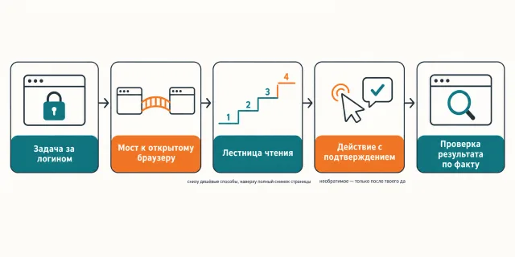

English · [Русский](README.md)

# Half of the work sits behind your login, and the agent sees exactly what is open to everyone

`jadlis-browser` connects to the Chrome you are already sitting in: logins, cookies and 2FA stay
where they are, no second profile and no `--remote-debugging-port`, and the skill reads a page by
a ladder — from a pinpoint search over the tree up to a full snapshot, which comes last.

```
claude plugin marketplace add https://github.com/beCyborg/jadlis-hub
claude plugin install jadlis-browser@jadlis
```

No keys needed, but a bridge extension inside Chrome is: you install it yourself, from the Chrome Web Store.


In words: on the left a browser window with the logins already done, on the right the data pulled
off the page, and along the bottom the rule — take the cheapest way to see the page, not the most
vivid one.

This is my workbench published as it is, not a product: whatever I stopped using, I removed.

## Before → after

| By hand | With an AI chat | With this plugin |
|---|---|---|
| **How the agent reaches a closed page.** You copy pieces of your account page into the chat yourself. | A public address it will fetch; behind a login it sees the sign-in form. | The work happens inside the Chrome you already have open, through a bridge extension: the session, the cookies and 2FA stay yours, and no separate profile is created. |
| **What it costs to see the page.** You look with your eyes — the agent sees nothing. | You paste the whole page text and pay for it in context. | The server runs with `--snapshot-mode=none`: no page snapshot arrives on its own after an action, and the skill climbs a ladder — tree search, a JS expression, a scoped snapshot, and a full snapshot last. |
| **What happens to screenshots.** You take them yourself and attach them. | The image goes into the thread whole and stays there. | The `--image-responses=omit` flag: a screenshot is always written to a file under `.playwright-mcp/` and read from disk when it is genuinely needed. |
| **An irreversible action on your account.** You press it yourself and own it. | It presses nothing: it has no session of yours. | The agent acts under your logins and asks you before sending, buying or deleting. That is a rule in the prompt, not a technical block. |
| **A click that silently did nothing.** You see it on screen and repeat it. | — | After a meaningful action the effect is checked, not the return code; the occluded-Chrome-window trap, where pointer actions hang while reading keeps working, is written down separately. |

## How it works



Going in — a task on a site you are already signed into; Chrome itself and the tab are kept open by you, not the plugin.
Inside — the bridge to the extension, a reading ladder from cheap to expensive, and a question before anything irreversible.
Coming out — the data pulled and the actions taken, verified by the live state rather than by a return code.

In words: task behind a login → bridge to the open browser → reading ladder → action with
confirmation → verification by the live state.

The plugin installs two things: the `playwright` MCP server and the skill. The runtime is pinned in
the repository's `.mcp.json`: the `@playwright/mcp@0.0.80` pin and four flags — `--extension`,
`--snapshot-mode=none`, `--console-level=error`, `--image-responses=omit`. The consequences show up immediately: after a click
or a navigation the agent is blind until it asks for a read itself; no base64 screenshot arrives;
only the core tool set is on.

The reading ladder, cheapest first: `browser_find` — grep over the accessibility tree;
`browser_evaluate` — a JS function that returns only the computed value; a scoped snapshot by
`target` and `depth`; a full snapshot as the last resort for an unfamiliar structure; a screenshot
only where visual semantics matter, and always through `filename`.

The main trap has its own section in the skill: a fully occluded Chrome window is frozen by macOS,
so clicks, hovers and drags hang until the timeout while `evaluate`, `find`, `type` and the waits
keep working. The cure is raising the window with `osascript` before a series of clicks.

Flows of five steps and more are handed by the skill to a subagent with a strict return contract.
There are no parallel browser subagents: a session holds one connection and every subagent shares it.

## Installing and the first run

**a) Text to paste to the agent.** Copy it whole into a Claude Code chat:

```
You are the installer. Put the jadlis-browser plugin from the jadlis marketplace on this Mac.
Run exactly these commands, verbatim, abbreviating nothing:
1. claude plugin marketplace add https://github.com/beCyborg/jadlis-hub
2. claude plugin install jadlis-browser@jadlis
3. claude plugin list — show me the jadlis-browser line and its version.
Then tell me in one line: install the Playwright MCP Bridge extension from the Chrome Web
Store and restart Claude Code.
The extension token is optional; Claude Code asks for it when the plugin is enabled.
Never print the token value: check only whether it is set or not.
Before each command show it to me in full and wait for a yes. If I say no, do not run it,
tell me what you skipped and move on.
If a command returns an error — stop, show the output, do not go on to the next one.
```

**b) The commands by hand.**

```
claude plugin marketplace add https://github.com/beCyborg/jadlis-hub
claude plugin install jadlis-browser@jadlis
claude plugin list
```

The first command installs nothing — it adds the marketplace. Only the second installs, and it is
removed by one line: `claude plugin uninstall jadlis-browser@jadlis --keep-data`.

**c) The short command.** Open Claude Code and type:

```
/browser
```

Not found — check the name with `claude plugin list`. The skill also triggers on a plain sentence:
"in my browser open the orders page and pull the statuses".

**The extension in Chrome.** Install [Playwright Extension](https://chromewebstore.google.com/detail/playwright-extension/mmlmfjhmonkocbjadbfplnigmagldckm)
from the Chrome Web Store (Chrome, Edge or Chromium), version 0.3.0 or newer — the bridge no longer
speaks the old protocol. On the first browser call the extension opens a tab-picker page and asks
you to confirm the connection. The token from the extension's status page removes that dialog:
Claude Code asks for it when the plugin is enabled, the value goes into the macOS Keychain and is
never written into config files; skipped it — set it later via `/plugin` → jadlis-browser → settings.

**The check.** "show me the browser tabs" → the reply lists the open tabs.

## Limits, cost, updating

**What it does not do.** It does not replace an ordinary scraper: a public page is cheaper to fetch
that way, and what belongs here is whatever lives behind your login. It does not upload files to a
site — in extension mode the privileged file-setting command is blocked by the browser, so you pick
the file by hand or drop it in. It does not open `file://`. It does not run in parallel: one
connection per session, parallel browser subagents are forbidden. It does not block irreversible
actions technically — it asks, but the keys to your account in its hands are yours. Arbitrary JS
inside the server process (`browser_run_code_unsafe`) stays gated: trusted pages only.

**What you need.** No keys and no subscriptions. You need Chrome (or Edge, or Chromium) with the
Playwright MCP Bridge extension 0.3.0 or newer, and `npx` in the system — it starts the server. The
extension token is optional and only removes the confirmation dialog. The application Claude Code is
started from needs Full Disk Access: without it the server cannot enumerate the Chrome extensions
folder and reports "Extension not found" while the extension is installed.

**How tokens get spent.** A run is light: no subagents, no fan-outs; what is expensive here is
reading the page, not the model. A full snapshot of an unfamiliar structure and screenshots cost
more than the rest, which is why both sit at the bottom of the ladder.

**Verified where I work:** my Mac, my Chrome. The `@playwright/mcp@0.0.80` and bridge-extension pair
was run through the `skills/browser/TESTS.md` matrix on 2026-09-01. Verified on macOS only; about
other systems I have nothing to say.

**Terms of use.** There is no license: all rights reserved by the author. You may read it and use it
personally. Commercial use, republishing and bundling it into your own products — by arrangement
with me.

**Updating.** With a third-party marketplace, auto-update is off on your side: until you run the
first command you keep the version you installed.

```
claude plugin marketplace update jadlis
claude plugin update jadlis-browser@jadlis
claude plugin list
```

A reinstall, if something landed wrong:

```
claude plugin uninstall jadlis-browser@jadlis --keep-data && claude plugin install jadlis-browser@jadlis
```

Version history — [CHANGELOG.md](CHANGELOG.md).
