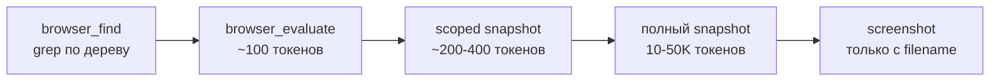

Русский · [English](README.en.md)

# jadlis-browser — залогиненный Chrome через Playwright MCP

Claude работает в твоём живом Chrome: логины, куки, сессии и 2FA уже на месте. Никаких отдельных профилей, `--remote-debugging-port` и повторных авторизаций.

## Зачем

Публичную страницу дешевле скачать обычным скрейпером. Сюда идут задачи, где нужен именно ты: личный кабинет, закрытая админка, сервис за 2FA.

Второе — расход контекста. Playwright MCP по умолчанию дописывает полный снапшот страницы после каждого действия: ~114K токенов на задачу против ~27K с дисциплиной чтения.

Плагин ставит две вещи: MCP-сервер `playwright` с флагами экономии и скилл, который учит лестнице чтения вместо снапшота на каждый чих.

## Как выглядит



Лестница читается снизу вверх по цене: берётся самый дешёвый инструмент, который решает задачу; полный снапшот — последнее средство для незнакомой структуры (тег `jadlis-browser--v2.0.0`).

## Как поставить

Ставится из маркетплейса `jadlis`:

```bash
claude plugin marketplace add https://github.com/beCyborg/jadlis-hub
claude plugin install jadlis-browser@jadlis
```

Дальше два шага в браузере:

1. Поставь расширение [Playwright Extension](https://chromewebstore.google.com/detail/playwright-extension/mmlmfjhmonkocbjadbfplnigmagldckm) из Chrome Web Store (Chrome, Edge или Chromium).
2. При первом обращении Claude к браузеру расширение откроет страницу выбора вкладки и попросит подтвердить подключение.

**Токен (опционально, убирает диалог подтверждения).** Кликни по иконке расширения → страница статуса → скопируй значение `PLAYWRIGHT_MCP_EXTENSION_TOKEN`. Claude Code спросит его при включении плагина (поле «Playwright Extension Token»); значение сенситивное — уезжает в Связку ключей macOS, в конфиг-файлы не пишется. Пропустил — задать позже через `/plugin` → jadlis-browser → настройки.

## Как пользоваться

Обычным текстом; скилл поднимается на упоминании браузера:

```
покажи вкладки браузера
в моём браузере открой страницу заказов и вытащи статусы
залогинься не надо — я уже вошёл, просто забери таблицу со второй вкладки
```

- **Проверка.** «покажи вкладки браузера» → `browser_tabs(action: "list")` вернёт список открытых вкладок.
- **Не подключается** — пройди чек-лист (Claude сделает это сам): Chrome запущен обычным способом? расширение установлено и включено? не закрыта ли вкладка-мост? профиль Chrome дефолтный (мост видит только Default)? токен скопирован целиком?
- **Длинные сценарии** (5+ шагов) скилл делегирует субагенту — один линейный flow за раз.

## Границы и стоимость

- **Оплаты нет.** Плагин бесплатный, API-ключей не требует; расход — только токены сессии.
- **Среда запуска фиксирована:** `@playwright/mcp@0.0.80` с `--extension --snapshot-mode=none --console-level=error --image-responses=omit`. Следствия: снапшот после действия не приходит сам (нужен явный `browser_find`/`browser_snapshot`), base64 скриншота не приходит (скриншот всегда с `filename`, затем Read), включён только core-набор инструментов.
- **Extension Mode хрупок к параллели:** один линейный flow за раз, субагенты делят одно подключение; перекрытое окно Chrome морозит рендеринг — клики висят, а `evaluate`/`find` работают.
- **Твои реальные привилегии.** Claude действует под твоими логинами; скилл требует явного подтверждения перед необратимыми действиями (отправка, покупка, удаление). Это правило в промпте, а не техническая блокировка.
- **`browser_run_code_unsafe`** (произвольный JS в процессе сервера) держится под гейтом: только доверенные страницы и по явной необходимости.

## Обновление

```bash
claude plugin update jadlis-browser@jadlis
```

Авто-обновление сторонних маркетплейсов у получателя выключено по умолчанию — включается один раз в `/plugin` → **Marketplaces**. История версий — [CHANGELOG.md](CHANGELOG.md).
